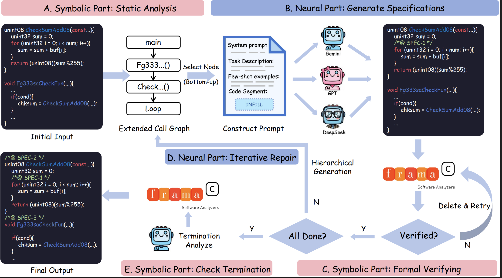
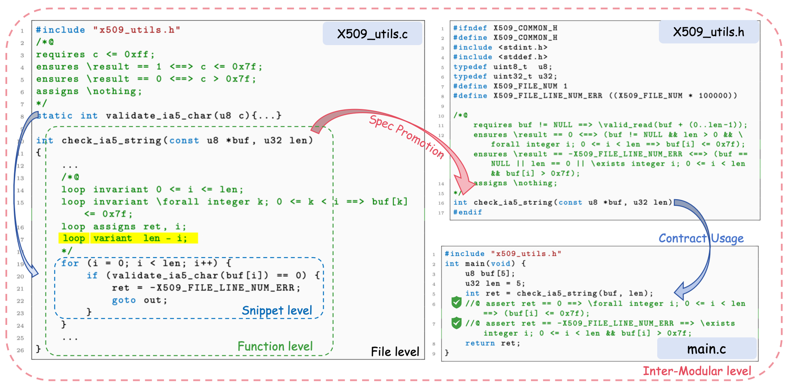

## Introduction

Formal verification provides rigorous guarantees for software correctness but often requires substantial manual effort to construct formal specifications (e.g., ACSL annotations for C programs). While recent advances in Large Language Models (LLMs) have shown promise in automating this process, existing approaches are often limited to partial correctness on isolated code snippets, struggling with complex, multi-file projects and infinite loops.

AutoSpec is an LLM-powered tool designed to bridge this gap. Building on our prior research prototype, AutoSpec delivers a practical, fully automated pipeline that transforms unannotated C code into formally verified software. It significantly extends the foundational capabilities by introducing **total correctness** proofs via termination analysis, a robust **model ensemble strategy** to mitigate LLM hallucinations, and a novel **inter-modular verification** workflow for handling project-level dependencies. Distributed as a zero-configuration **Docker container**, AutoSpec lowers the barrier to entry for rigorous software verification.

### Tool Overview



----------

## Install and Deployment

### docker image downloads
```sh
docker pull junjiehu1905/autospec:latest
docker pull junjiehu1905/termination_analysis:latest
```

### clone this repo
```sh
git clone git@github.com:Xidian-ICTT-GZ/AutoSpec.git
```

### run docker image and mount local files
```sh
docker run -it --rm -v $(pwd):/app docker_name /bin/bash
```

### install veri-clang
```sh
cd LLM4Veri
bash ./scripts/install/install_veri-clang.sh
```

### test clang and veri-clang
```sh
clang --version
veri-clang --version
```

----------

## Usage

### Set up API_KEY and BASE_URL

there is a models_config.yaml at config/ filefolder, and there are some examples help u to set the env.
further, you need to set your API_KEY to the ~/.bashrc

### set LLM API_KEY
```sh
echo 'export OPENAI_API_KEY=""' >> ~/.bashrc
source ~/.bashrc
```

### Annotate C/C++ source file

Usage:

The script main.py executes autospec on a user-specified set of C source files.
The parameter -f accepts one or more .c files, separated by commas.
This is useful when verifying a small component of a project where multiple C files depend on each other.
Header files (.h) do not need to be specified; they are automatically discovered and indexed using framac's multi-file support.
Users select the LLM backend models using the -m parameter.

```sh
python3 main.py -f file1.c,file2.c,... -o output-dir -m model1,model2,...
```


For large-scale benchmark evaluation, auto_run.py supports batch verification by processing all C files within a directory specified by -i. It also enables the model-ensemble strategy via -m, leveraging parallel synthesis across multiple LLMs to improve verification success.

```sh
python3 auto_run.py -i input-dir -o output-dir -m model1,model2,...
```


After partial correctness has been established using either of the above modes, generate_variant.py performs termination analysis.It synthesizes ranking functions and invokes framac's WP plugin to validate termination, thereby upgrading verification results from partial correctness to total correctness.
The script accepts either a list of C files -f or a directory -i matching the earlier modes.

```sh
python3 generate_variant.py -f file1.c,file2.c,... -o output-dir -m model1,model2,...
```

## Inter-Modular Verification Demo
This example demonstrates AutoSpec's capability to verify complex, multi-file C projects. It uses a simplified X.509 certificate parser case study where the safety assertion in the caller (main.c) depends on the behavioral contract of a separate utility module (x509_utils.c). AutoSpec automatically synthesizes the implementation contract and promotes it to the shared header (x509_utils.h), enabling successful verification across compilation units.


Try it yourself: The source code for this demo is located in LLM4Veri/dataset/inter-modular. You can run the verification pipeline with the following command:

```sh
python3 inter-modular_run.py -i main.c x509_utils.c x509_utils.h -m <model_name>
```
(Replace <model_name> with your target LLM, e.g., gpt-4.)