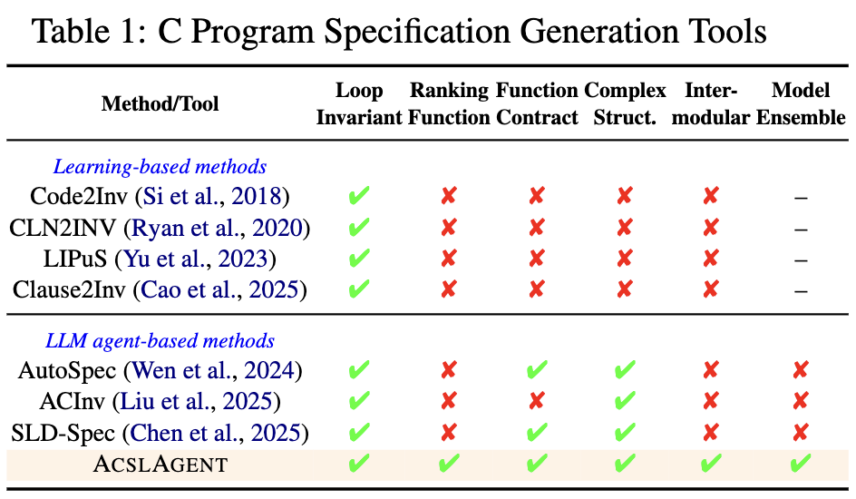
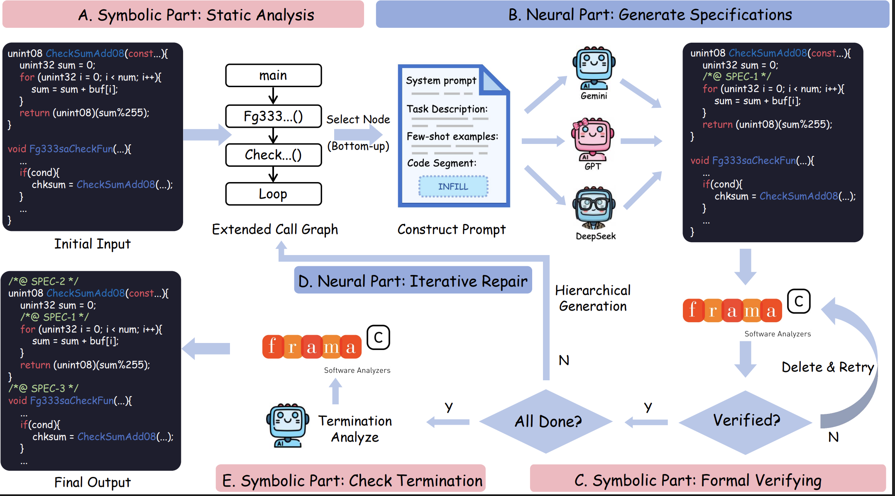
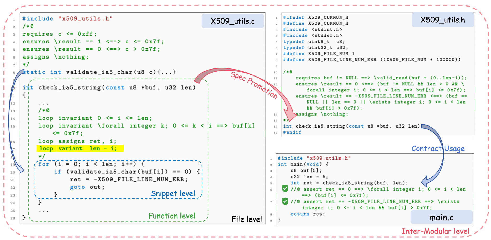
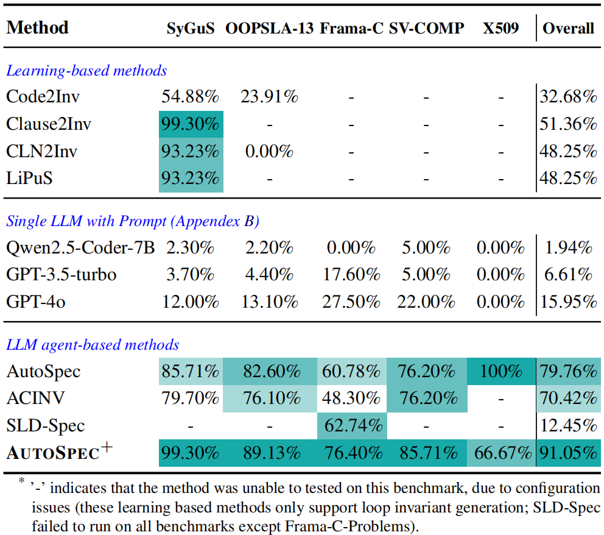
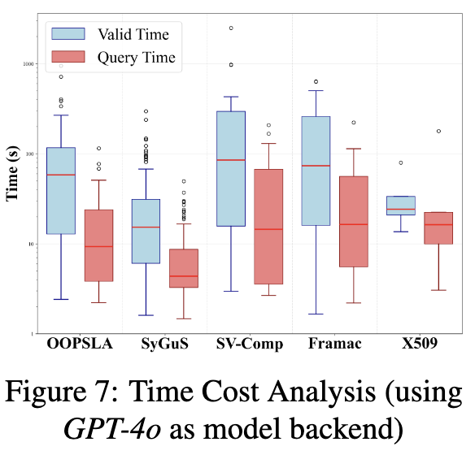
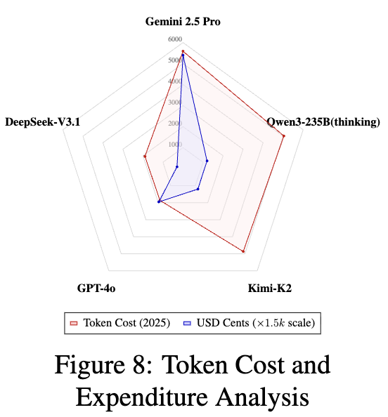

# ACSLAGENT: LLM-Driven Neuro-Symbolic Program Specification Synthesis

ACSLAGENT is a neuro-symbolic tool that automates formal specification writing for C programs by reframing it as constrained structured synthesis. It uses Large Language Models (LLMs) to generate candidate specifications (contracts, loop invariants, and ranking functions) while employing the Frama-C/WP symbolic verifier as a deterministic critic to ensure correctness.

## Key Features

**Neuro-Symbolic Loop**: Integrates neural generation with symbolic verification to produce proof-ready annotations.
**Proof-Aware Decomposition**: Constructs an extended call graph to synthesize specifications bottom-up, reducing context length and focusing on proof-relevant code slices.
**Iterative Repair**: Automatically refines failing specifications using verifier feedback without restarting from scratch.
**Total Correctness Support**: Generates ranking functions (loop variants) to upgrade proofs from partial to total correctness.
**Inter-Modular Verification**: Analyzes cross-file dependencies and promotes verified contracts to header interfaces for modular verification.
**Model Ensemble**: Supports a replaceable LLM backend via a unified interface, allowing queries across multiple models (e.g., Gemini, GPT, DeepSeek) for increased robustness.
<p align="center">
  
</p>

---
## Workflow

The tool operates through five main stages: static analysis, neural specification generation, formal verification, iterative repair, and optional termination analysis.

<p align="center">
  
</p>

---

## Example

ACSLAGENT transforms unannotated C code into verifier-accepted annotated programs. Below is an example of an industrial C program from an aerospace control system annotated with synthesized ACSL specifications.

<p align="center">
  
</p>

---

## Installation & Resources


**Full Experimental Results**: [https://huggingface.co/spaces/saki222/experient_result_full](https://huggingface.co/spaces/saki222/experient_result_full)

**Demonstration Video**: [https://youtu.be/rwA2kyzljac](https://youtu.be/rwA2kyzljac) 

---

## Evaluation

ACSLAGENT achieves a state-of-the-art verification success rate of 91.05% (pass@5) across diverse benchmarks including SyGuS, SV-COMP, and real-world industrial components.

<p align="center">
  
  
  
</p>

---


## Install and Deployment

### docker image downloads
```sh
docker pull junjiehu1905/acslagent:latest
docker pull junjiehu1905/termination_analysis:latest
```

### clone this repo
```sh
git clone git@github.com:Xidian-ICTT-GZ/AutoSpec.git
```

### run docker image and mount local files（may take a while at the first time）
```sh
docker run -it --rm -v $(pwd):/app docker_name /bin/bash
```

### install veri-clang
```sh
cd LLM4Veri
bash ./scripts/install/install_veri-clang.sh
```

### test clang and veri-clang
```sh
clang --version
veri-clang --version
```

----------

## Usage

### Set up API_KEY and BASE_URL

there is a models_config.yaml at config/ filefolder, and there are some examples help u to set the env.
further, you need to set your API_KEY to the ~/.bashrc

### Config
The model config file is at config/models_config.yaml file.
you need to set a config template at A.ConfigTemplates including:template name, platform, api_key_env, base_url and timeout.

Then, go to B.ModelMap set your model name and its corresponding template name you've just written. 

### set LLM API_KEY
```sh
echo 'export OPENAI_API_KEY=""' >> ~/.bashrc
source ~/.bashrc
```
or
```sh
vim ~/.bashrc
export OPENAI_API_KEY="xxx"
source ~/.bashrc
```

### Annotate C/C++ source file

Usage:

The script main.py executes autospec on a user-specified set of C source files.
The parameter -f accepts one or more .c files, separated by commas.
This is useful when verifying a small component of a project where multiple C files depend on each other.
Header files (.h) do not need to be specified; they are automatically discovered and indexed using framac's multi-file support.
Users select the LLM backend models using the -m parameter.

```sh
python3 main.py -f file1.c -o output-dir -m model_name
```


For large-scale benchmark evaluation, auto_run.py supports batch verification by processing all C files within a directory specified by -i. It also enables the model-ensemble strategy via -m, leveraging parallel synthesis across multiple LLMs to improve verification success.

```sh
python3 auto_run.py -i input-dir -o output-dir -m model1,model2,...
```


After partial correctness has been established using either of the above modes, generate_variant.py performs termination analysis.It synthesizes ranking functions and invokes framac's WP plugin to validate termination, thereby upgrading verification results from partial correctness to total correctness.
The script accepts either a list of C files -f or a directory -i matching the earlier modes.

```sh
python3 generate_variant.py -f file1.c,file2.c,... -o output-dir -m model1,model2,...
```

## Inter-Modular Verification Demo
This example demonstrates AutoSpec's capability to verify complex, multi-file C projects. It uses a simplified X.509 certificate parser case study where the safety assertion in the caller (main.c) depends on the behavioral contract of a separate utility module (x509_utils.c). AutoSpec automatically synthesizes the implementation contract and promotes it to the shared header (x509_utils.h), enabling successful verification across compilation units.


Try it yourself: The source code for this demo is located in LLM4Veri/dataset/inter-modular. You can run the verification pipeline with the following command:

```sh
python3 inter-modular_run.py -i main.c x509_utils.c x509_utils.h -m <model_name>
```
(Replace <model_name> with your target LLM, e.g., gpt-4.)

